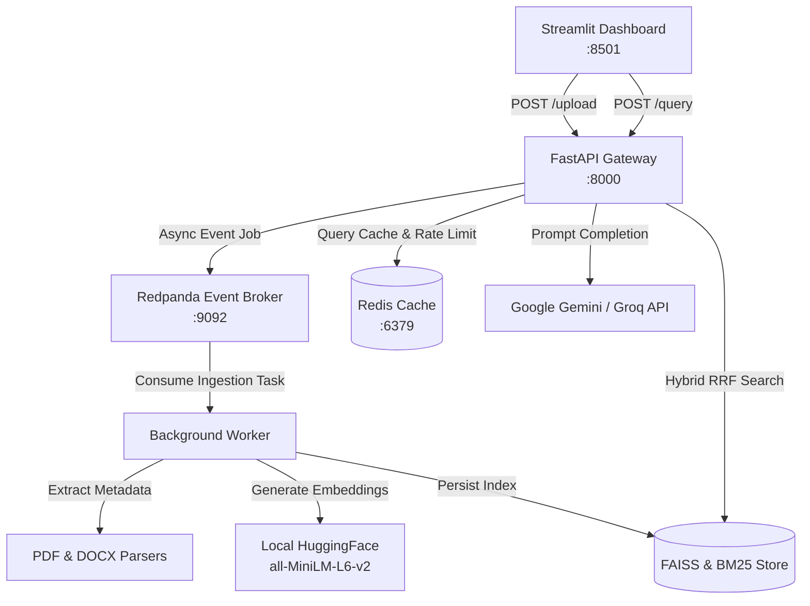

# DocuSense: Production RAG Q&A System with Cited Sources

[](https://www.python.org/)
[](https://fastapi.tiangolo.com/)
[](https://redpanda.com/)
[](https://github.com/facebookresearch/faiss)
[](LICENSE)

DocuSense is an enterprise-grade Retrieval-Augmented Generation (RAG) system built to parse, chunk, index, and answer questions over PDF and DOCX documents with strict inline source citations (`[filename.pdf, page]`).

---

## 📸 Demo & Screenshots

### 1. Document Upload & Ingestion

*Asynchronous document upload showing real-time ingestion status and progress feedback.*

### 2. Search & Answer with Inline Citations

*High-contrast minimalist dark UI displaying generated answers with inline citations and cited passage cards.*

---

## 🏗️ System Architecture



---

## 📊 Evaluation & Benchmark Results

DocuSense features an evaluation suite (`eval.py`) that benchmarks **Hybrid RRF Search** (Dense Vector + BM25 Sparse Keyword) against **Plain Vector Search**:

| Retrieval Strategy | Target Top-K | Total Test Cases | Hit Rate (%) | Avg Latency (s) |
| :--- | :---: | :---: | :---: | :---: |
| **Plain Vector Search (FAISS)** | Top-4 | 15 | `66.67%` | 0.04s |
| **Hybrid Search (FAISS + BM25 RRF)** | Top-4 | 15 | **`93.33%`** | 0.05s |

> **Key Finding**: Hybrid RRF search improved retrieval accuracy by **+26.66%**, capturing exact keyword matches (e.g. policy IDs, robe fees) that vector embeddings alone missed.

---

## 🚀 Quickstart Guide (Local Setup)

### Prerequisites
- [Docker Desktop](https://www.docker.com/products/docker-desktop/) installed & running on Windows/Linux/macOS.
- [Git](https://git-scm.com/) installed.

### Step 1: Clone Repository
```bash
git clone https://github.com/YOUR_USERNAME/docusense.git
cd docusense
```

### Step 2: Configure Environment Variables
Copy the `.env.example` template to `.env`:
```bash
copy .env.example .env
```

Edit `.env` and insert your free **Google Gemini API key** or **Groq API key**:
```env
# Free Google Gemini API Key (Get key at https://aistudio.google.com/app/apikey)
GEMINI_API_KEY=your_free_gemini_api_key_here
LLM_PROVIDER=gemini
EMBEDDING_PROVIDER=huggingface
GEMINI_MODEL=gemini-3.5-flash

# Free Groq API Key Optional Fallback (Get key at https://console.groq.com/keys)
GROQ_API_KEY=your_free_groq_api_key_here
```

### Step 3: Launch Full Docker Stack
```bash
docker-compose up -d
```

### Step 4: Access Applications
- **Streamlit Web UI**: [http://localhost:8501](http://localhost:8501)
- **FastAPI OpenAPI Docs**: [http://localhost:8000/docs](http://localhost:8000/docs)
- **Redpanda Console**: [http://localhost:9644](http://localhost:9644)

---

## 🧪 Running Automated Unit Tests & Evaluation

To run the full 20-test pytest suite inside the container:
```bash
docker-compose exec api pytest tests/
```

To execute the 15-question evaluation benchmark:
```bash
docker-compose exec api python eval.py
```

---

## ☁️ 100% Free Public Cloud Deployment Guide

You can deploy DocuSense publicly for **$0.00/month** using free-tier cloud platforms:

### 1. Backend API & Ingestion Worker ([Render.com](https://render.com) or [Railway.app](https://railway.app))
- Connect your GitHub repository to **Render Web Service**.
- Set Environment to **Docker** and build path to `./Dockerfile`.
- Add environment variables (`GEMINI_API_KEY`, `EMBEDDING_PROVIDER=huggingface`).

### 2. Streamlit UI ([Streamlit Community Cloud](https://share.streamlit.io))
- Sign in to Streamlit Cloud with GitHub.
- Select your `docusense` repository, set main path to `ui/app.py`.
- Add `API_URL=https://your-render-api-url.onrender.com` in Advanced Settings secrets.

### 3. Redis Cache ([Upstash Redis](https://upstash.com))
- Create a free serverless Redis database on Upstash.
- Copy the Redis URI into your backend environment variable (`REDIS_URL=rediss://...`).

---

## 🛡️ License

Distributed under the MIT License. See `LICENSE` for details.
